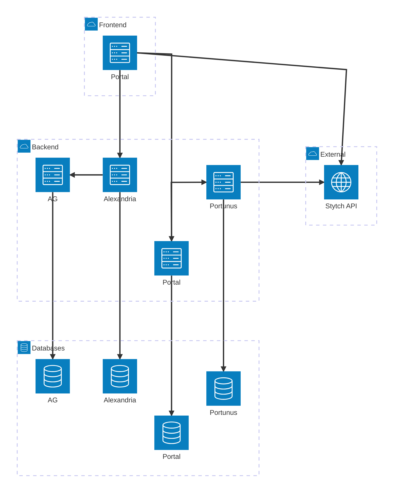

```mermaid
architecture-beta
    group frontend(cloud)[Frontend]
        service portalReact(server)[Portal] in frontend

    group backend(cloud)[Backend]
        service portalRuby(server)[Portal] in backend
        service alexandria(server)[Alexandria] in backend
        service ag(server)[AG] in backend
        service portunus(server)[Portunus] in backend

    group databases(database)[Databases]
        service db_portal(database)[Portal] in databases
        service db_alex(database)[Alexandria] in databases
        service db_ag(database)[AG] in databases
        service db_portunus(database)[Portunus] in databases

    group external(cloud)[External]
        service stytch(internet)[Stytch API] in external

    portalReact:R --> T:stytch
    portalReact:R --> T:portalRuby
    portalReact:B --> T:alexandria
    alexandria:L --> R:ag
    portalRuby:T --> L:portunus
    portunus:R --> L:stytch

    portalRuby:B --> T:db_portal
    alexandria:B --> T:db_alex
    ag:B --> T:db_ag
    portunus:B --> T:db_portunus

```