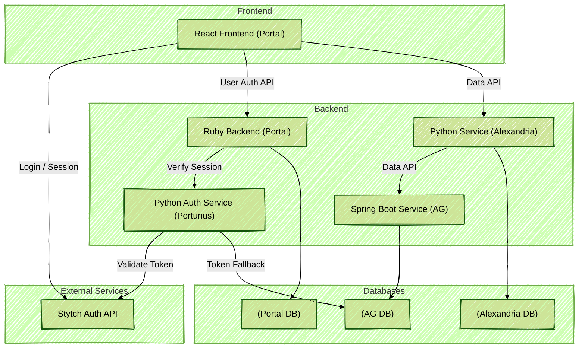

```mermaid
---
config:
  theme: forest
  look: handDrawn
---

graph TD
    %% Frontend
    subgraph Frontend
        PortalReact["React Frontend (Portal)"]
    end

    %% Backend
    subgraph Backend
        PortalRuby["Ruby Backend (Portal)"]
        AlexandriaPython["Python Service (Alexandria)"]
        AGSpring["Spring Boot Service (AG)"]
        PortunusPython["Python Auth Service (Portunus)"]
    end

    %% Databases
    subgraph Databases
        DB_Portal["(Portal DB)"]
        DB_Alexandria["(Alexandria DB)"]
        DB_AG["(AG DB)"]
    end

    %% External Services
    subgraph External Services
        Stytch["Stytch Auth API"]
    end

    %% Frontend Connections
    PortalReact -->|Login / Session| Stytch
    PortalReact -->|User Auth API| PortalRuby
    PortalReact -->|Data API| AlexandriaPython

    %% Backend Internal Calls
    AlexandriaPython -->|Data API| AGSpring
    PortalRuby -->|Verify Session| PortunusPython

    %% Auth Service
    PortunusPython -->|Validate Token| Stytch

    %% Database Connections
    PortalRuby --> DB_Portal
    AlexandriaPython --> DB_Alexandria
    AGSpring --> DB_AG
    PortunusPython -- Token Fallback --> DB_AG


```